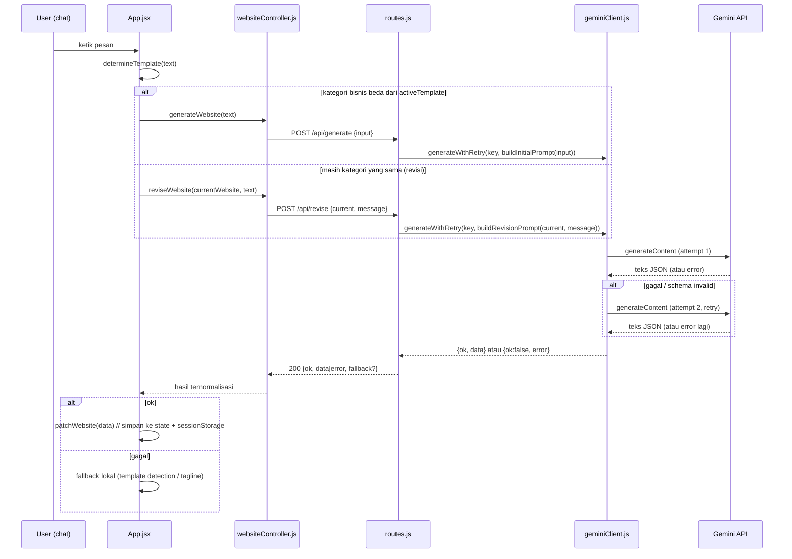

# Alur AI Engine — AI UMKM Website Builder

Dokumen ini untuk **Dev 1A (AI Engine, Prompt Design, LLM Integration)** memahami
bagaimana permintaan chat berubah menjadi JSON website, di mana harus
menyentuh kode kalau mau mengubah prompt/model, dan bagaimana kegagalan
LLM ditangani. Untuk FRD/JSON Schema/backlog lengkap, lihat `SKILL.md`.
Untuk pemisahan backend/frontend secara umum, lihat struktur folder
`server/` vs `src/` vs `shared/`.

## 1. Peta kode: siapa memanggil siapa

```
src/App.jsx  (frontend, UI chat)
    │  user ngetik pesan
    ▼
src/lib/websiteController.js   generateWebsite() / reviseWebsite()
    │  fetch('/api/generate' | '/api/revise')
    ▼
server/routes.js               registerApiRoutes()
    │  parse body, pilih prompt
    ▼
server/prompts.js              buildInitialPrompt() / buildRevisionPrompt()
    │  string prompt jadi
    ▼
server/geminiClient.js         generateWithRetry()
    │  panggil Gemini, retry 1x, validasi schema
    ▼
shared/schema.js                validateWebsite() / getFallback()
```

`server/index.js` cuma "lem": dia daftarin route (`routes.js`) dan docs
(`openapi.js`) ke Vite dev/preview server. Kalau mau paham alur AI-nya,
fokus ke 4 file: **prompts.js → geminiClient.js → routes.js →
websiteController.js**, plus titik integrasinya di `App.jsx`.

## 2. Dua alur: Generate vs Revise

Keduanya pakai mesin yang sama (`generateWithRetry`), bedanya cuma prompt
dan kapan dipanggil dari `App.jsx`.



**Kapan generate vs revise dipilih** (`App.jsx`, fungsi `handleSendPrompt`):
sebelum manggil LLM sama sekali, ada gate `isDeterministicAction` — kalau
pesan cocok kata kunci warna/headline/menu/WA, itu ditangani lokal
tanpa panggil API sama sekali (hemat kuota, instan). LLM baru dipanggil
untuk pesan "umum" (deskripsi bisnis baru atau revisi bebas):

```js
const detected = determineTemplate(text)
const isNewBusinessDescription = detected !== activeTemplate
const result = isNewBusinessDescription
  ? await generateWebsite(text)          // draft baru
  : await reviseWebsite(websiteData, text) // revisi dari state sekarang
```

## 3. Kontrak prompt (`server/prompts.js`)

`SYSTEM_PROMPT_V1` adalah satu string, dipakai untuk generate maupun
revise. Aturan yang sudah di-encode di prompt:

- Output **harus** JSON murni — tanpa markdown fence, tanpa komentar.
- Field harus persis sesuai `UMKMWebsiteState` (lihat `shared/schema.js`
  dan `SKILL.md` §5) — dilarang menambah field di luar skema.
- `templateId` cuma 3 pilihan: `template-services` / `template-fnb` /
  `template-retail`.
- `theme.primaryColor`/`accentColor` wajib hex `#RRGGBB`,
  `theme.fontFamily` enum `sans|serif|display`.
- `services` minimal 3 item, `testimonials` minimal 2.
- `contact.whatsappNumber` format lokal `08...` (normalisasi ke `62...`
  terjadi di frontend, lihat `src/lib/templateSelector.js:formatWhatsappNumber`).

`buildInitialPrompt(userInput)` menempel input user (dipotong 1000 char)
lalu minta "Balas JSON saja". `buildRevisionPrompt(oldJson, userMsg)`
menyertakan **state JSON saat ini** (dipotong 3500 char) + instruksi
eksplisit: *ubah HANYA field yang diminta, jangan hapus section lain,
balas JSON LENGKAP yang sudah direvisi* — bukan diff/patch parsial.
Alasannya: parsing JSON parsial dari LLM jauh lebih rawan error
daripada minta objek lengkap tiap kali, dan `patchWebsite` di frontend
sudah cukup pintar untuk merge-nya (lihat §5).

`trimHistory(history, max=3)` disiapkan untuk membatasi konteks chat
per NFR-05 (maks ~2000 token/turn) tapi **belum dipanggil di mana pun**
saat ini — revisi cuma mengirim state JSON terakhir, bukan riwayat
chat. Kalau nanti prompt mulai menyertakan riwayat percakapan penuh,
panggil `trimHistory` sebelum menyusun prompt di `routes.js`.

**Kalau mau ganti prompt/aturan**: edit `SYSTEM_PROMPT_V1` di satu
tempat ini saja — otomatis berlaku untuk generate & revise.

## 4. Pemanggilan model & retry (`server/geminiClient.js`)

```js
const GEMINI_MODEL = 'gemini-2.0-flash'
const MAX_ATTEMPTS = 2        // 1x percobaan awal + 1x retry
const REQUEST_TIMEOUT_MS = 15000
```

Alur `generateWithRetry(apiKey, promptText)`:
1. Panggil Gemini (`callGeminiOnce`) dengan `temperature: 0.7`,
   `maxOutputTokens: 2048`.
2. Ambil `candidates[0].content.parts[0].text`, buang pagar
   ```` ```json ```` kalau LLM tetap membungkusnya (defensif, walau
   prompt sudah melarang), lalu `JSON.parse`.
3. Validasi dengan `validateWebsite()` (`shared/schema.js`).
4. Kalau gagal di step manapun (network error, timeout 15s, JSON tidak
   valid, atau schema tidak valid) → **retry sekali** dari awal.
5. Kalau percobaan ke-2 juga gagal → return `{ ok:false, error }`,
   pesan error terakhir dibawa naik untuk logging.

**Kalau mau ganti model**: cukup ubah `GEMINI_MODEL`. Kalau mau ganti
jumlah retry atau timeout: ubah `MAX_ATTEMPTS`/`REQUEST_TIMEOUT_MS` di
file yang sama — semua endpoint (`/api/generate` dan `/api/revise`)
otomatis ikut karena keduanya lewat fungsi ini.

## 5. Apa yang terjadi setelah AI berhasil (frontend)

`websiteController.js` cuma bungkus `fetch` — tidak ada logic bisnis di
situ, murni network + normalisasi error (`{ok:false, error:'network'}`
kalau fetch gagal/timeout 20s di sisi klien).

Begitu `App.jsx` dapat `{ ok:true, data }`, dia panggil
`patchWebsite(data)` (dari `src/store/websiteStore.jsx`). Karena
`buildRevisionPrompt` selalu minta JSON **lengkap** (bukan diff),
`patchWebsite` mengganti tiap section top-level yang ada di `data`
secara utuh (bukan merge per-field) — supaya field lama dari mock data
(mis. `about.description`) tidak nyangkut campur dengan field baru dari
skema resmi (`about.story`). Satu pengecualian: `contact.whatsappNumber`
tidak pernah hilang meski LLM lupa mengembalikannya (guard eksplisit di
`patchWebsite`, memenuhi US-07: "tanpa merusak nomor WhatsApp").

State ini otomatis tersimpan ke `sessionStorage` (lihat
`WebsiteProvider` di file yang sama), jadi reload halaman tidak
menghilangkan hasil generate/revisi AI.

## 6. Kalau AI gagal / key belum diset

Tidak ada mode "loading forever" atau crash. Urutan fallback:

1. `GEMINI_API_KEY` belum diset di server → `routes.js` langsung balas
   `{ ok:false, error:'not_configured' }` tanpa memanggil Gemini sama
   sekali (cepat, tidak nunggu timeout).
2. `GEMINI_API_KEY` ada tapi generate gagal 2x → `/api/generate` balas
   `{ ok:false, error:'llm_failed', fallback:getFallback(input) }` —
   `fallback` ini data statis yang siap pakai per kategori (lihat
   `shared/schema.js:FALLBACKS`), meski saat ini `App.jsx` belum
   memakai field `fallback` ini dan memilih fallback deterministiknya
   sendiri (`determineTemplate` + template mock) — lihat catatan di §8.
3. Di `App.jsx`, setiap hasil `ok:false` (apa pun errornya selain
   `not_configured`) memicu toast "AI tidak merespons, menggunakan mode
   offline", lalu jatuh ke logic lama: deteksi kategori bisnis via
   keyword (`determineTemplate`) untuk draft baru, atau update
   `meta.tagline` seadanya untuk revisi.

Uji manual tanpa key:
```bash
curl -X POST http://localhost:3000/api/generate \
  -H "Content-Type: application/json" \
  -d '{"input":"Warung Bakso Pak Slamet"}'
# -> {"ok":false,"error":"not_configured"}
```

## 7. Konfigurasi & cara coba dengan API key asli

Set **`GEMINI_API_KEY`** (server-only, tanpa prefix `VITE_` — sengaja,
supaya key tidak pernah masuk ke bundle browser) di `.env` lokal, lalu
`npm run dev`. Kalau ke-set, log server akan diam (tidak ada warning
`GEMINI_API_KEY not set`), dan `/api/generate`/`/api/revise` akan betul
memanggil Gemini.

Dokumentasi interaktif endpoint: jalankan `npm run dev` lalu buka
`http://localhost:3000/api/docs` (Swagger UI, generated dari
`server/openapi.js`) — bisa langsung coba `POST /api/generate` dari
browser tanpa nulis curl.

## 8. Known gaps / PR terbuka untuk Dev 1A

- `trimHistory()` sudah ada tapi belum dipakai — revisi saat ini hanya
  mengirim state JSON terakhir, bukan riwayat chat multi-turn. Kalau
  butuh AI mengingat percakapan sebelumnya (bukan cuma state terakhir),
  ini titik masuknya.
- ~~`fallback` yang dikirim balik oleh `/api/generate` saat `llm_failed`
  belum dipakai oleh `App.jsx`~~ — **sudah beres** (issue #15): `App.jsx`
  bagian "Offline/failure fallback" sudah membaca `result.fallback` dan
  memprioritaskan `templateId`-nya di atas tebakan lokal
  (`determineTemplate`) kalau keduanya beda. Dibuktikan oleh
  `tests/e2e/backend-fallback.spec.js` — sebelumnya cuma
  `mockGenerateFailure` (`fallback: null`) yang dipakai di test, jadi jalur
  ini belum pernah benar-benar teruji meski kodenya sudah jalan.
- Belum ada test otomatis untuk `generateWithRetry`/`validateWebsite`
  (mis. mock response Gemini yang malformed, pastikan retry+fallback
  jalan). Cocok buat TSK-07A (stability testing, Hari 8).
